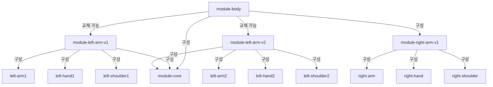
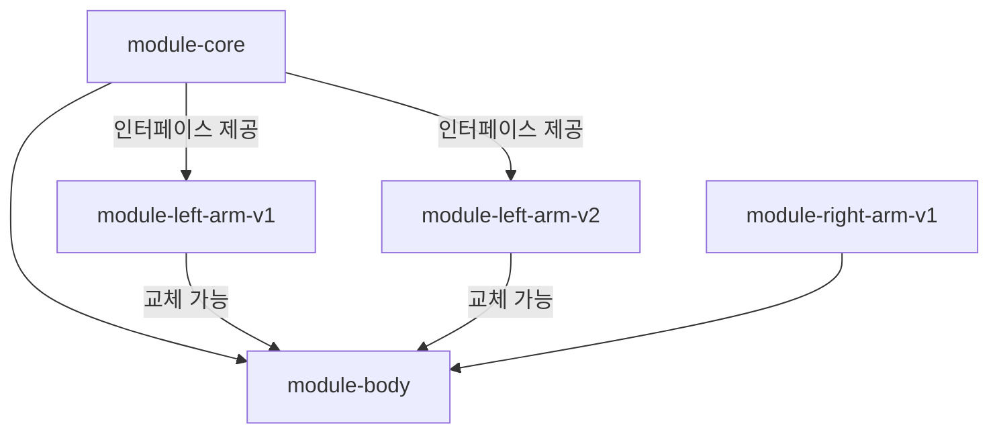

#  아이언맨으로 이해하는 멀티모듈

<blockquote data-ke-style="style1">
  <p data-ke-size="size16">
    <span style="font-family: 'Noto Serif KR';"></span>
  </p>
  <p><strong>🐋 멀티모듈의 유지보수성과 유연한 교체를 시연한 프로젝트입니다.</strong></p>
  <p>아이언맨으로 시작하는 멀티모듈 설명은 아래 링크를 확인해주세요!</p>
  <a href="https://nettee.notion.site/ironman-multimodules">🔗 아이언맨으로 이해하는 멀티모듈</a>
</blockquote>

## 부연 설명
- Spring이 아닌 **Java Project 입니다.**
- Java 멀티 모듈이 아닌 **Gradle 멀티 모듈입니다.**
- `ironman-multi-module/settings.gradle.kts` 에서 모듈 설정을 볼 수 있습니다.
- `ironman-multi-module/build.gradle.kts` 에서 `allProjects` 를 통해 Java 21 로 전역 설정. (변경 가능)
- **`module-body/build.gradle.kts` 에서 left-arm-v1과 left-arm-v2 사이에 유연한 교체가 가능합니다.**
- **`left-arm-v1`과 `left-arm-v2`에서 Build Script 의 `implementation` 과 `api` 차이점을 확인할 수 있습니다.** 
- **module-core 를 통해** module-body 와 module-left-arm-v1 사이에 **순환 참조를 해결**하였습니다.

## 폴더 구조 
```
ironman-multi-module
├─module-body ⭐ (Main 함수 위치)       
├─module-core ⭐ (인터페이스 제공)
├─module-left-arm-v1
│  ├─left-arm
│  ├─left-hand
│  ├─left-shoulder
├─module-left-arm-v2
│  ├─left-arm
│  ├─left-hand
│  ├─left-shoulder
├─module-right-arm-v1
│  ├─right-arm
│  ├─right-hand
│  ├─right-shoulder
```
## 모듈 관계도 

### 의존 방향



### 대입 방향

`module-core`(인터페이스 제공) 추가로 인한 `module-body` 와 `module-left-arm-v1(2)` 
사이에 **순환 참조 오류 해결**이 가능합니다.

<table border="3">
  <tr height="30">
    <td>🚨 순환 참조 오류란?<br/>
    두 개 이상의 모듈이 서로를 참조하는 상황을 말하며, Gradle 빌드 중 Cycle detected in the project dependencies 등의 오류를 발생합니다. 
<br/> ex) 모듈 A <-> 모듈 B,  서로가 Import 하는 상황
<br/> ex) 모듈 A -> 모듈 B -> 모듈 C -> 모듈 A
</td>
  </tr>
</table>



## 모듈 교체 시연

module-body/build.gradle.kts 에서 `module-left-arm-v1` 과 `module-left-arm-v2` 주석을 서로 해지하며 교체되는 것을 확인 할수 있습니다.

```kotlin
// module-body/build.gradle.kts
// 모듈 혹은 라이브러리 등록을 담당하는 DSl
dependencies {
    implementation(project(":module-core"))
    implementation(project(":module-right-arm-v1"))
    // v1 교체
    // implementation(project(":module-left-arm-v1"))
    // v2 교체
    implementation(project(":module-left-arm-v2"))
}
```
### Main 실행

<table border="3">
  <tr height="30">
    <td> 🚀 Body.main() 결과 </td>
  </tr>
</table>

- **implementation(project(":module-left-arm-v2")) 활성화 시**
```
> Task :module-body:Body.main()
Ironman Boot on!
Right Arm Version 1
RightArm activated
RightHand activated
RightShoulder activated
Left Arm Version 2
LeftArm activated
LeftHand activated
LeftShoulder activated
```
- **implementation(project(":module-left-arm-v1")) 활성화 시**
```
> Task :module-body:Body.main()
Ironman Boot on!
Right Arm Version 1
RightArm activated
RightHand activated
RightShoulder activated
Left Arm Version 1
LeftArm activated
LeftHand activated
LeftShoulder activated
```
